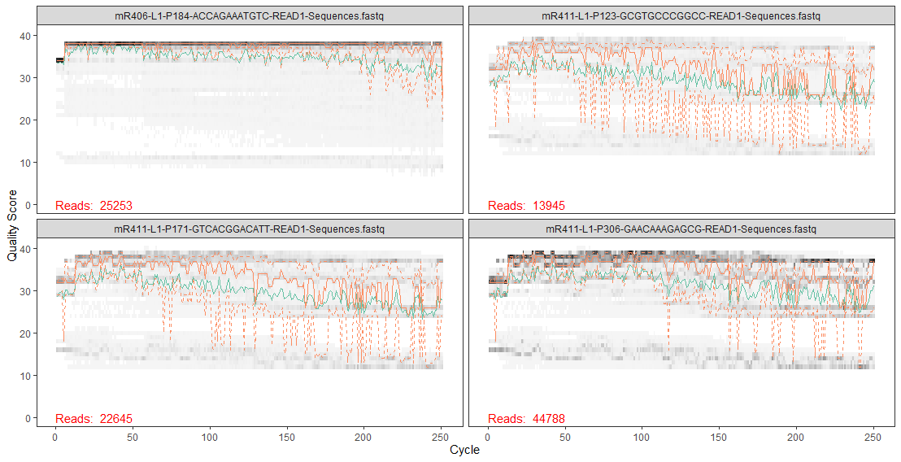

# Final Project Report:

From Microbes to Phenotype: Characterizing Microbial Diversity and Community Differences Between Early and Late Flowering _Arabidopsis thaliana_

Author: Joaquin Lopez, Alejandra Hernandez Teran, Maria Rebolleda-Gomez

## Introduction

Microbial communities influence plant phenotypes by shaping ontogeny through processes such as nutrient acquisition and stress response, in turn affecting life history traits such as growth rate, reproductive timing, and overall fitness (Metcalf et. al 2019). A growing body of research has introduced the concept of microbiome-dependent ontogeny timing (MiDOT), where host species rely on microbial cues to regulate critical life history transitions (Metcalf et. al 2019). MiDOT also includes both accelerated and delayed developmental events in response to microbial communities, highlighting relationships between hosts and their microbial consortia (Metcalf et. al 2019). Previous research studies have shown that plant-associated microbiomes can influence traits such as disease resistance, growth, and abiotic stress tolerance across multiple generations (Puy et al., 2022; Lu et al. 2018), showing MiDOT can also play an important role in these processes. For instance, a recent experiment using multi-generational approaches revealed that microbiomes selected for specific plant traits, like flowering time, can reproducibly alter plant development and function, showing how microbial communities drive rapid phenotypic changes in plant populations over time (Lu et. al 2018). Highlighting the role of microbiota in regulating key life history transitions—such as flowering in plants—by either accelerating or delaying ontogenetic events, allowing hosts to adapt developmentally to microbial cues that ultimately maximize their fitness.

Building on these findings, we designed an experimental study aimed at exploring how MiDOT shapes plant development and function, influencing various aspects of life history. This study began with the collection of rhizosphere samples _from Brassica nigra_ (_B. nigra_) found in the University of California Natural Reserve Elliot Chaparral and Deep Canyon. Soil slurries were prepared to inoculate Col-0 genotype _Arabidopsis thaliana_ (_A. thaliana_) Col-0 mutant seed types. After inoculation, _A. thaliana_ seedlings were grown within a germination chamber using Murashige and Skoog (MS) media lacking sucrose. Once true leaves emerged, the seedlings were transferred into falcon tubes containing sterile sand and slow release fertilizer. Phenotypic traits, including flowering time, were measured every other day.

Based on results, microbial communities promoting early and late flowering were selected for an experimental evolution trial. In this trial, we used selected inoculates to grow 48 replicates of Col-0 _A. thaliana_ seedlings per treatment, including early flowering (EF) and late flowering (LF) groups, as well as controls. Once seedlings from transfer 1 germinated, they were transferred to soil, and phenotypic traits were measured routinely. Rhizosphere samples were then taken from EF and LF plant groups to inoculate a new batch of Col-0 _A. thaliana_ seedlings for transfer 2. This process continued until 4 transfers were completed. Additionally, rhizosphere samples from transfer 1 rhizosphere were used to extract microbial DNA using a soil DNA extraction kit, followed by the amplification of the 16s rRNA using PCR. Illumina next generation sequencing (NGS) was then used to perform high throughput sequencing and obtain 16s rRNA sequencing data.

Using collected 16s data I explored the role of microbial community composition in regulating flowering time in _A. thaliana_. Specifically, investigating how shifts in microbial community composition and diversity influence the timing of flowering by analyzing 16s rRNA sequences extracted from the rhizosphere of microbial communities associated with early and late flowering plant types. Key questions that guided this project included: How does the microbial community composition differ between early and late stage flowering types? Are there specific taxa that exhibit higher abundance in one community compared to the other? I aimed to assess how diverse the microbial populations are within each community, and how these differences contribute to the developmental outcomes observed in _A. thaliana_.

## Methods

16s rRNA sequence analysis was conducted using the DADA2 pipeline and Phyloseq package in Rstudio (Callahan et al. 2016). Raw forward reads, stored in the directory “C:/Users/joaqu/Documents/ee282_project_analysis/16s_seq”, were processed for quality control and downstream analysis. File names matching “READ1-Sequences” were identified and extracted, allowing for the quality of the forward reads to be determined using DADA2’s plotQualityProfile() function, visually inspecting the quality distribution. Reads were then filtered and trimmed using the filterAndTrim() function, with a truncation length of  210 base pairs, maximum of 0 ambiguous bases (maxN), a maximum expected error rate (maxEE) of 2, and a truncation quality score (truncQ) threshold of 2. Once PhiX, the control DNA sequence used as an internal quality control, was removed, reads were filtered, compressed, and saved into a subdirectory named “filtered”.

Error rates were then modeled using the learnErrors() function, which learns error profiles specific to the dataset. Dereplication was performed using derepFastq() to combine identical sequences, reducing redundancy. The dada() function, a DADA algorithm, was applied to the dereplicated reads, generating amplicon sequence variants (ASV). A sequence table was then created using makeSequenceTable() to represent the abundance of each ASV across samples. Potential chimeric sequences were removed using removeBimeraDenovo(), followed by calculating the dimensions of the sequence table and the proportion of non-chimeric reads to verify data integrity. Additional tracking tables were made summarizing the progression of read counts through the pipeline from input to filtering, denoising, and chimera removal using the custom tracking function getN().

Taxonomy was then assigned to ASV’s using the SILVA database, an online repository containing high quality aligned rRNA gene sequences from the Bacteria, Archaea, and Eukarya domains (Quast et al. 2013). The assigTaxonomy() function was used to provide classifications at various taxonomic levels, and addSpecies() allowed for species level annotations where available. The resulting taxonomy table linked each ASV to its corresponding taxonomy and a Phyloseq object was created by integrating the ASV sequence table, taxonomy table, and sample metadata. Samples labeled as “mock” were excluded from the Phyloseq object using prune_samples() and sample names were then renamed using the sample_names() function in Phyloseq, replacing raw sample names, such as “mR406-L1-P184-ACCAGAAATGTC”, with descriptive names like “LF-1”, and updated throughout the analysis.

Alpha diversity, including Shannon and Simpson indices, was then obtained using the estimate_richness() function, visualized for each sample using plot_richness(), and results saved as a CSV file (richness_data.csv). The relative abundance of microbial taxa was then analyzed using two approaches. A family based relative abundance was obtained as ASVs were grouped at the family using tax_glom(taxrank=’Family’), and the top 4 families were identified based on total abundance across all samples. This was visualized using plot_bar() as relative abundance bar plots titled “Relative Abundance of the Top 4 Families by Total Counts”. For the second approach, a ASV based relative abundance was obtained where the top 4 ASVs were identified directly based on total abundance. The relative abundances was then calculated and visualized as a bar plot using plot_bar(), titled “Relative Abundance of Top 4 ASVs by Total Counts”. The processed data was then exported as CSV files for downstream analysis including Shannon and Simpson indices (richness_data.csv), raw ASV counts (out_table_raw.csv), ASV abundances as percentages (otu_table_percentage.csv), relative abundance of the top 4 families (top4_family_relative_abundance_table.csv), relative abundance of the top 4 ASVs (top4_asv_relative_abundance_table.csv), and family level relative abundances (family_level_relative_abundance_table.csv).

Lastly, analysis outputs were organized and uploaded to the Github repository JoaquinL2114/ee282 under the branch final_project. The repository was organized as follows: Raw data containing forward read sequences were compressed into a sequence.zip file and stored in data/raw. Processed data, including csv files, were organized into a folder named csv_data and placed into data/processed. PNG visuals, such as bar plots, alpha diversity plots, metric tables, and quality control plots, were stored in code/analysis. The R script used for this analysis, titled project_analysis_Rscript, was uploaded to the code/scripts directory.

## Results

The quality of the forward reads was assessed to determine the optimal truncation point for filtering. Where a decline in quality was displayed toward the 3’ end, prompting to truncate reads at 210 base pairs during filtering (Fig 1). This removed low quality sequences at the end of the reads. After filtering, the number of reads retained at each stage is displayed in table 1. An error model for the forward reads then demonstrated the error rates aligned closely to the predicted model, showing the accuracy of the error prediction (Fig 2.) After constructing the error model, total reads were dereplicated into unique sequences for each sample. For sample mR406-L1-P184-ACCAGAAATGTC, 21,898 total reads were reduced to 8,278 unique sequences. Sample mR411-L1-P123-GCGTGCCCGGCC had 8,625 total reads reduced to 5,844 unique sequences, while sample mR411-L1-P171-GTCACGGACATT had 14,513 total reads reduced to 8,308 unique sequences, and sample mR411-L1-P306-GAACAAAGAGCG had 33,572 total reads reduced to 13,481 unique sequences.

A total of 162 unique ASVs were identified across all samples. 80 chimeric sequences were then identified and removed from 242 input sequences, resulting in 91.37% of total sequences being retained in the final dataset. Alpha diversity demonstrated IF had the highest Shannon index of 3.571 and the highest Simpson index of 0.925 (Fig 3). While EF-1 had the lowest Shannon index of 2.177 and the lowest Simpson index of 0.831 (Fig 3).

The relative abundance of the top 4 ASVs was then analyzed across the four samples. Where _Xanthomonadaceae_ was present in samples LF-1, LF-2, and EF-1, with the highest abundance in EF-1 (9,213 counts) and lower abundances in LF-1 (18 counts) and LF-2 (40 counts) (Fig 4). _Enterobacteriaceae_ was most abundant in EF-1 (4,152 counts), with lower relative abundance observed in LF-1 (897 counts) and LF-2 (133 counts) (Fig 4). Mitochondria was only found in LF-1 (4,933 counts) (Fig 4). _Pseudomonadaceae_ was found in all four samples with the highest abundance in EF-1 (3,479 counts) and the least abundant in IF (75 counts) (Fig 4).

Following the analysis of the top 4 ASV relative abundance, the relative abundance of the top 4 microbial families was calculated by summing the total counts for each family across the 4 samples. _Xanthomonadaceae_ was present in all four samples, with the highest abundance seen in EF-1 (9,527 counts) and lower abundances in LF-1 (1,108 counts), LF-2 (40 counts), and IF (383 counts) (Fig 5). _Enterobacteriaceae_ showed its highest abundance in EF-1 (7,051 counts), moderate abundance in LF-2 (3,837 counts), and lower abundances in LF-1 (1,699 counts) and IF (95 counts) (Fig 5). Mitochondria was present in only 3 samples, with the highest abundance in LF-1 (5,811 counts) and lower counts in LF-1 (163 counts) and EF-1 (546 counts) (Fig 5). _Pseudomonadaceae_ was found in all 4 samples, exhibiting the highest abundance in EF-1 (4,636 counts), and lower relative abundance in LF-1 (3, 863 counts), LF-2 (1,152 counts), and IF (233 counts) (Fig 5). Lastly, the relative abundance of taxa by family was used to provide an overview of the family level composition of the microbial community in each sample, with families varying among samples, some samples having a more even distribution, and others being dominated by one or two families (Fig 6).

Table1. Table summarizing the number of reads retained at each stage of the 16s sequence analysis pipeline. The table displays the number of input reads, filtered reads, denoised reads, and non-chimeric reads for each of the four samples.

Figure 1. Quality profile of the forward reads used in the analysis. The plot displays the distribution of quality scores along the read length, with the position on the x-axis and the quality score on the y-axis. This plot informs the selection of trimming parameters during filtering.

Figure 2. Error frequency plot showing the observed versus expected error rates for nucleotide position. The plot illustrates the DADA2 error model used to correct sequencing errors, with quality scores on the x-axis and error frequencies on the y-axis.

Figure 3. Boxplot of alpha diversity indices (Shannon and Simpson) for each sample. The plot visualizes the Shannon index measuring species richness and evenness, while the Simpson index measures species dominance. Sample IF had the highest diversity, as indicated by the highest Shannon  (3.571 and Simpson (0.925) indices, while sample EF-1 showed the lowest diversity with a Shannon index of 2.177 and a Simpson index of 0.831. Sample names are represented on the x-axis and diversity index values on the y-axis.

Figure 4. Bar plot showing the relative abundance of the top 4 most abundant microbial families across all samples. The relative abundance was calculated based on the total ASV counts for each family across all samples. The y-axis represents the relative abundance, and the x-axis displays the sample names.

Figure 5. Bar plot displaying the relative abundance of the top 4 microbial families across all samples. The relative abundance was calculated using the total counts within each family relative to the total number of reads for each sample. Each bar represents the relative proportion of each family within the respective sample. The y-axis represents the relative abundance, and the x-axis displays the sample name.

Figure 6. Stacked bar plot showing the relative abundance of microbial taxa collected at the family level across samples. Each bar represents a sample, with different colors representing distinct microbial families. The y-axis represents the relative abundance, and the x-axis displays the sample name. A legend is included to identify the microbial families, with each family name corresponding to a color in the plot.

## Discussion

This study shows how microbial communities influence flowering time in _Arabidopsis thaliana_, with a focus on microbial communities associated with early and later flowering in plants. Distinct differences in microbial diversity, composition, and relative abundance were observed between EF-1 and LF-1, providing insight to potential microbial mechanisms driving the timing of flowering. 16s rRNA analysis revealed that EF-1 and LF-1 had unique microbial communities, with specific taxa potentially playing roles in shaping their respective phenotypes. The microbial community in EF-1, collected from Elliot Chaparral, held the lowest alpha diversity compared to other samples (Fig 3). This lower alpha diversity may be due to the dominance of specific microbial taxa, such as _Stenotrophomonas_ and _Pantoea agglomerans_, potentially outcompeting other taxa (Fig 4). These taxa may play a key role in early flowering phenotypes as the prevalence of _Stenotrophomonas_ in EF-1 aligns with its known role in promoting plant growth and its potential to serve as a microbial cue for developmental transitions (Ryan et al. 2009). Additionally, the presence of _Pantoea agglomerans_, an antifungal bacterium, may reduce competition from fungal pathogens, promoting healthier plant development (Walterson and Stavrinides 2015).

In contrast, the microbial community in LF-1, also collected from Elliot Chaparral, displayed higher alpha diversity, suggesting a more diverse microbial community (Fig 3). This is seen with Mitochondria being a dominant taxa, later identified as _Penicillium_ through BLAST, which was not present in EF-1. The presence of _Penicillium_ in LF-1 suggests the potential for fungal influences on flowering time. However, _Stenotrophomonas_ and _Psuedomonandaceae_ were also present in LF-1 but at significantly lower relative abundances compared to EF-1 (Fig 4). The increased diversity in LF-1 may show a broader range of microbial interactions, potentially driving late flowering.

This initial study provided important insights into the relationship between microbial communities and flowering time in _Arabidopsis thaliana_. The distinct differences seen between EF-1 and LF-1 prompted an expansion of the study to include the sequencing and downstream analysis of 197 samples collected from the four University of California Nature Reserve sites. This future broader study will aim to identify microbial taxa associated with flowering time across different environmental conditions. Therefore using a larger dataset with increased site diversity, will give a more comprehensive understanding of how microbial communities contribute to flowering time regulation, and potentially other microbial mechanisms driving plant development.

## References

Metcalf CJE, Henry LP, Rebolleda-Gómez M, Koskella B.2019.Why Evolve Reliance on the Microbiome for Timing of Ontogeny?. mBio10:10.1128/mbio.01496-19.https://doi.org/10.1128/mbio.01496-19

Puy, J., Carmona, C. P., Hiiesalu, I., Öpik, M., de Bello, F., & Moora, M. (2022). Mycorrhizal symbiosis alleviates plant water deficit within and across generations via phenotypic plasticity. Journal of Ecology, 110, 262–276. https://doi.org/10.1111/1365-2745.13810

Lu, T., Ke, M., Lavoie, M. et al. Rhizosphere microorganisms can influence the timing of plant flowering. Microbiome 6, 231 (2018). https://doi.org/10.1186/s40168-018-0615-0

Callahan, B. J., McMurdie, P. J., Rosen, M. J., Han, A. W., Johnson, A. J. A., & Holmes, S. P. (2016). DADA2: High-resolution sample inference from Illumina amplicon data. Nature Methods, 13(7), 581–583. https://doi.org/10.1038/nmeth.3869

Quast, C., Pruesse, E., Yilmaz, P., Gerken, J., Schweer, T., Yarza, P., Peplies, J., & Glöckner, F. O. (2013). The SILVA ribosomal RNA gene database project: Improved data processing and web-based tools. Nucleic Acids Research, 41(D1), D590–D596. https://doi.org/10.1093/nar/gks1219

Ryan, R. P., Monchy, S., Cardinale, M., Taghavi, S., Crossman, L., Avison, M. B., Berg, G., van der Lelie, D., & Dow, J. M. (2009). The versatility and adaptation of bacteria from the genus Stenotrophomonas. Nature Reviews Microbiology, 7(7), 514–525. https://doi.org/10.1038/nrmicro2163

Walterson, A. M., & Stavrinides, J. (2015). Pantoea: Insights into a highly versatile and diverse genus within the Enterobacteriaceae. FEMS Microbiology Reviews, 39(6), 968–984. https://doi.org/10.1093/femsre/fuv027

