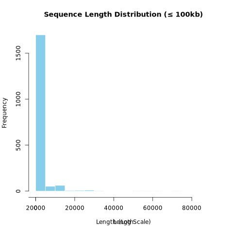
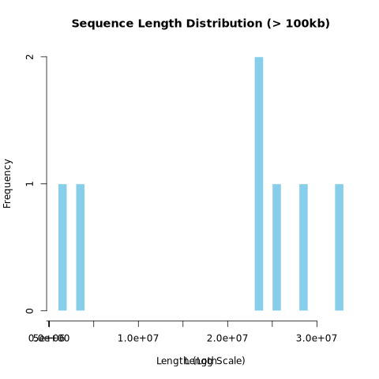
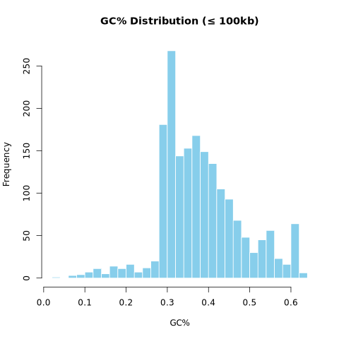
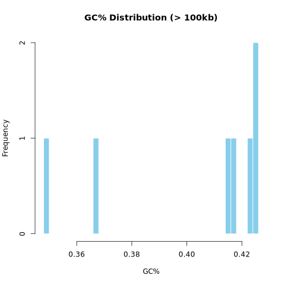
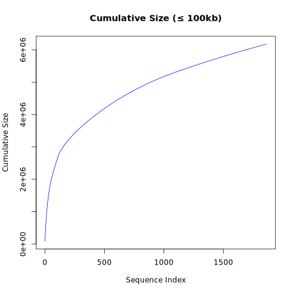
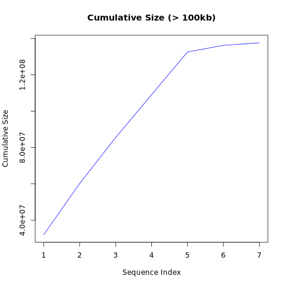

# Homework 4: Pipelines, Plotting, Genome Assembly

## Author: Joaquin Lopez

## Summary Partitions of Genome Assembly

Sequences ≤ 100kb:

1. Total number of nucleotides: 6178042
2. Total number of Ns: 662593
3. TOtal number of sequences: 1863

Sequences > 100kb:

1. Total number of nucleotides: 137547960
2. Total number of Ns: 490385
3. Total number of sequences: 7

Plots for all sequences ≤ 100kb and all sequences > 100kb:

### Small Sequences (≤ 100kb)

### Large Sequences (> 100kb)

## GC% Distribution
### Small Sequences (≤ 100kb)

### Large Sequences (> 100kb)

## Cumulative Size Plots
### Small Sequences (≤ 100kb)

### Large Sequences (> 100kb)

## Genome Assembly

